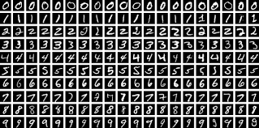

# Digit Classification CLI

A Python package for training, evaluating, and deploying a digit classifier on a curated subset of the MNIST dataset using a command-line interface.

This project uses an imbalanced subset of the classic MNIST dataset, which contains grayscale 28×28 handwritten digit images. We focus on three digit classes: 0, 5, and 8, selected to create a realistic class imbalance scenario:

3,500 images labeled 8

1,200 images labeled 0

300 images labeled 5

The full dataset consists of 5,000 images, all sourced from the MNIST training split. The model is trained using CPU only, with evaluation on a held-out 20% test split. A sample image is included below:
<p align="center">  </p>
---

### Testing & Coverage Summary

- 🟢 **Tests Passing**
- **Coverage:** [81% – View Report](htmlcov/index.html)

---

## 1. Installation

### Local (Python 3.11+)

Install dependencies with [**pyenv**](https://github.com/pyenv/pyenv) and [**Poetry**](https://python-poetry.org/docs/):

```bash
pyenv install 3.11.12
pipx install poetry==1.8.1

git clone https://github.com/your-org/digit-classification.git
cd digit-classification
poetry install
```

### Docker

Build the container from the included [Dockerfile](https://docs.docker.com/engine/reference/builder/):

```bash
docker build -t digit-classification .
```

---

## 2. CLI Workflow

```bash
# Download the dataset
digit-classification download-data --data-dir ./data

# Train for {n} epochs
digit-classification train \
  --data-dir   /path/to/data/root \
  --output-dir /path/to/your/output \
  --epochs     {n}

# Evaluate on test split
digit-classification evaluate \
  --checkpoint-path ./runs/exp1/last.ckpt \
  --data-dir        ./data
```

### 🐋 Docker (Mounted at Runtime)

Run any command with `./data` mounted as `/cache`:

```bash
docker run --rm -v $(pwd)/data:/cache digit-classification \
  download-data --data-dir /cache
```

Repeat the same `-v $(pwd)/data:/cache` mount for `train`, `evaluate`, etc.

---

## 3. CLI Commands

| Command         | Description                        | Key Flags                                |
| --------------- | ---------------------------------- | ---------------------------------------- |
| `download-data` | Download MNIST subset              | `--data-dir`                             |
| `train`         | Train CNN                   | `--data-dir`, `--output-dir`, `--epochs` |
| `evaluate`      | Evaluate on test set               | `--checkpoint-path`, `--data-dir`        |
| `predict`       | Predict single image probabilities | `--checkpoint-path`, `--input-path`      |

```bash
digit-classification <command> --help
```

---

## 4. Run Tests / Pre-Commit

```bash
poetry run pytest
poetry run pre-commit run --all-files
```

---

## 5. Local Environment Tested On

| Component | Version                                             |
| --------- | --------------------------------------------------- |
| Python    | 3.11.12 ([pyenv](https://github.com/pyenv/pyenv))   |
| Poetry    | 1.8.1 ([docs](https://python-poetry.org/docs/))     |
| Docker    | 24.x+ ([docs](https://docs.docker.com/get-docker/)) |
| OS        | macOS 13 (Intel)                                    |

---

## License

MIT License © 2025 [Sam Lausten](https://github.com/srlausten)
